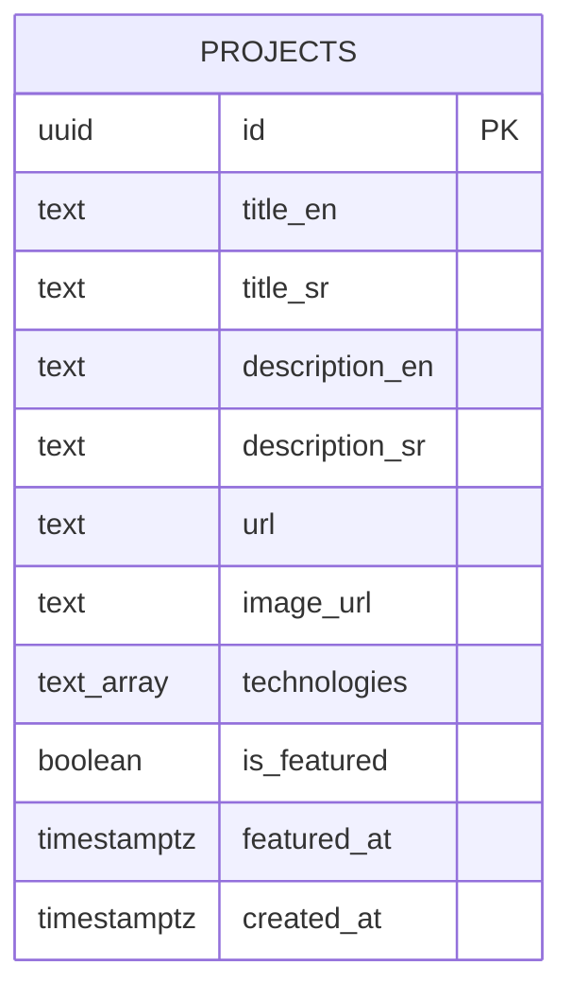

# DB.md — Šema baze podataka

> Šema Supabase (PostgreSQL) baze, izvedena iz `PRD.md`. Pokriva tabele, tipove, sigurnosne politike (RLS), trigere i Storage.

## 1. Pregled

Baza čuva samo **projekte** za portfolio. Ostali sadržaj (usluge, About, prevodi) je statičan u kodu. Posetioci imaju isključivo pravo čitanja; unos i izmena projekata radi se ručno preko Supabase Table Editor-a.



## 2. Tabela `projects`

| Kolona | Tip | Null | Default | Opis |
| --- | --- | --- | --- | --- |
| `id` | `uuid` | NE | `gen_random_uuid()` | Primarni ključ |
| `title_en` | `text` | NE | — | Naslov projekta (engleski) |
| `title_sr` | `text` | NE | — | Naslov projekta (srpski) |
| `description_en` | `text` | DA | — | Kratak opis / tehnologije (engleski) |
| `description_sr` | `text` | DA | — | Kratak opis / tehnologije (srpski) |
| `url` | `text` | NE | — | Link ka živom sajtu projekta (otvara se u novom tabu) |
| `image_url` | `text` | DA | — | Ručni fallback screenshot (ako se OG slika ne povuče) |
| `technologies` | `text[]` | DA | `'{}'` | Lista tehnologija (prikaz kao badge oznake) |
| `is_featured` | `boolean` | NE | `false` | Da li je projekat istaknut na Home strani |
| `featured_at` | `timestamptz` | DA | — | Vreme kada je projekat označen kao istaknut |
| `created_at` | `timestamptz` | NE | `now()` | Vreme kreiranja |

### SQL — kreiranje tabele

```sql
create table public.projects (
  id             uuid primary key default gen_random_uuid(),
  title_en       text not null,
  title_sr       text not null,
  description_en text,
  description_sr text,
  url            text not null,
  image_url      text,
  technologies   text[] not null default '{}',
  is_featured    boolean not null default false,
  featured_at    timestamptz,
  created_at     timestamptz not null default now()
);

-- Korisni indeksi za sortiranje/izdvajanje
create index projects_created_at_idx on public.projects (created_at desc);
create index projects_featured_idx   on public.projects (is_featured, featured_at desc);
```

## 3. Row Level Security (RLS)

Sajt je read-only za posetioce. Dozvoljavamo samo `SELECT` anonimnim korisnicima; unos/izmena ide preko Supabase dashboarda (service role, zaobilazi RLS).

```sql
alter table public.projects enable row level security;

create policy "Public can read projects"
  on public.projects
  for select
  using (true);
```

> INSERT / UPDATE / DELETE politike se NE kreiraju za anon korisnike. Vlasnik unosi podatke kroz Supabase Table Editor.

## 4. Trigger — najviše 3 istaknuta projekta

Pravilo iz PRD-a: kada postoji više od 3 istaknuta projekta, najstariji po `featured_at` se vraća na `is_featured = false` (red se NE briše).

```sql
-- Funkcija: postavi featured_at i ograniči broj istaknutih na 3
create or replace function public.enforce_max_3_featured()
returns trigger as $$
begin
  -- Pri označavanju kao istaknut, zabeleži vreme
  if new.is_featured and (tg_op = 'INSERT' or old.is_featured is distinct from new.is_featured) then
    new.featured_at := now();
  end if;

  -- Ako je projekat prestao da bude istaknut, očisti featured_at
  if not new.is_featured then
    new.featured_at := null;
  end if;

  return new;
end;
$$ language plpgsql;

create trigger trg_set_featured_at
  before insert or update on public.projects
  for each row execute function public.enforce_max_3_featured();

-- Posle upisa: ako ima više od 3 istaknuta, ugasi najstarije
create or replace function public.trim_featured_projects()
returns trigger as $$
begin
  update public.projects
  set is_featured = false,
      featured_at = null
  where id in (
    select id
    from public.projects
    where is_featured = true
    order by featured_at desc
    offset 3
  );
  return null;
end;
$$ language plpgsql;

create trigger trg_trim_featured
  after insert or update of is_featured on public.projects
  for each statement execute function public.trim_featured_projects();
```

> Napomena: koriste se dva trigera — `before` za postavljanje `featured_at`, i `after ... for each statement` za "odsecanje" viška istaknutih, čime se izbegava rekurzija na nivou reda.

## 5. Logika prikaza na Home strani (do 3 projekta)

Ovo je upit/logika aplikacije (ne trigger), redosled prioriteta:

1. Istaknuti (`is_featured = true`) sortirani po `featured_at desc`.
2. Ako ih je manje od 3 → dopuniti najnovijim neistaknutim po `created_at desc`.
3. Ako nema nijednog istaknutog → 3 najnovija po `created_at desc`.
4. Ako ukupno ima manje od 3 projekta → prikazati onoliko koliko ih ima.

Stranica `Projects` prikazuje **sve** projekte (istaknute i neistaknute), sortirane po `created_at desc`.

## 6. Storage

- Bucket: **`project-images`** (javno čitanje) — za ručno otpremljene screenshot-ove (`image_url` fallback).
- Preview sa živih sajtova (`og:image`) se povlači uživo i NE čuva se u Storage.

```sql
-- Bucket se kreira kroz Supabase dashboard ili:
insert into storage.buckets (id, name, public)
values ('project-images', 'project-images', true)
on conflict (id) do nothing;
```

Politika javnog čitanja za bucket:

```sql
create policy "Public read project-images"
  on storage.objects
  for select
  using (bucket_id = 'project-images');
```

## 7. Primer unosa (referenca)

```sql
insert into public.projects (title_en, title_sr, description_en, description_sr, url, technologies, is_featured)
values (
  'Example Shop', 'Primer Prodavnice',
  'E-commerce built with Next.js and Supabase.',
  'E-prodavnica izrađena u Next.js i Supabase.',
  'https://example-shop.com',
  array['Next.js','Supabase','Tailwind'],
  true
);
```

## 8. Veza sa Env varijablama

Pristup bazi koristi (definisano u `.env.local`, videti `Tech.md`):
- `NEXT_PUBLIC_SUPABASE_URL`
- `NEXT_PUBLIC_SUPABASE_PUBLISHABLE_KEY`
