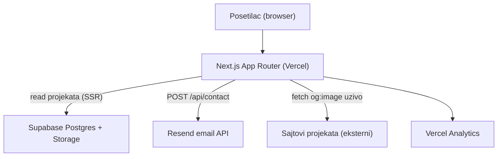

# Tech.md — Arhitektura i tehnička implementacija

> Tehnički prateći dokument uz `PRD.md`. Opisuje KAKO se projekat implementira, koje servise i biblioteke koristi i na koji način. Detalji baze su u `DB.md`.

## 1. Trenutno stanje (provereno u repozitorijumu)

Projekat je Next.js aplikacija inicijalizovana sa `create-next-app`, sa već postavljenim osnovama.

### 1.1 Već instalirane zavisnosti (`package.json`)

**Runtime:**
- `next` 16.2.7 (App Router)
- `react` 19.2.4 / `react-dom` 19.2.4
- `@supabase/ssr` ^0.10.3 — Supabase klijent za SSR
- `@supabase/supabase-js` ^2.108.0
- `resend` ^6.12.4 — slanje email-a
- `@remixicon/react` ^4.9.0 — ikonice
- `radix-ui` ^1.5.0 — primitivi za UI
- `shadcn` ^4.10.0 — UI komponente
- `class-variance-authority` ^0.7.1, `clsx` ^2.1.1, `tailwind-merge` ^3.6.0 — utili za klase
- `tw-animate-css` ^1.4.0 — animacioni utili

**Dev:**
- `tailwindcss` ^4 + `@tailwindcss/postcss` — stilizovanje
- `typescript` ^5, `@types/*`
- `eslint` ^9 + `eslint-config-next` 16.2.7

### 1.2 Već postojeća konfiguracija i kod

- **TypeScript:** `tsconfig.json` sa alias-om `@/*` → root (`./*`).
- **shadcn/ui:** `components.json` (style `radix-sera`, baseColor `neutral`, iconLibrary `remixicon`, RSC uključen). Alias-i: `@/components`, `@/components/ui`, `@/lib`, `@/lib/utils`, `@/hooks`.
- **Stilovi/tema:** `app/globals.css` — Tailwind v4, definisana paleta (tamno-ljubičasta + neon-zelena `#95f702`), animirani gradijent pozadine, font varijable.
- **Fontovi:** `app/layout.tsx` — `Space_Grotesk` (naslovi, `--font-heading`), `Raleway` (telo, `--font-sans`), uz Geist Sans/Mono.
- **Supabase helperi:** `utils/supabase/server.ts` (server, koristi `cookies()`).
- **Kontakt:** `app/api/contact/route.ts` — POST ruta, validira polja i šalje email preko Resend-a.
- **Utili:** `lib/utils.ts` — `cn()` (clsx + tailwind-merge).
- **UI:** `components/ui/button.tsx`.
- **`next.config.ts`** — prazna konfiguracija (treba dopuniti: `images.remotePatterns`, i18n plugin).

### 1.3 Environment varijable (`.env.local`, postojeće)

- `NEXT_PUBLIC_SUPABASE_URL`
- `NEXT_PUBLIC_SUPABASE_PUBLISHABLE_KEY` (napomena: kod koristi *publishable* ključ, ne `ANON_KEY`)
- `RESEND_API_KEY`
- `CONTACT_TO_EMAIL`

## 2. Zavisnosti koje treba dodati

| Biblioteka | Svrha |
| --- | --- |
| `next-intl` | Dvojezičnost EN/SR sa URL prefiksom i `hreflang` za SEO |
| `framer-motion` | Efektne scroll/hover animacije |
| `@vercel/analytics` | Besplatna analitika bez kolačića (nema cookie banera) |
| `sonner` | Toast notifikacije (potvrda slanja forme) |

Dodatne shadcn/ui komponente (instaliraju se po potrebi): `input`, `textarea`, `label`, `card`, `badge`, `sonner`.

## 3. Visok nivo arhitekture



- Sadržaj projekata se čita iz Supabase-a na serveru (SSR) radi SEO-a i brzine.
- Usluge i About sadržaj su statični (u kodu/prevodima), ne u bazi.
- Kontakt forma šalje POST na internu API rutu koja zove Resend.

## 4. i18n (EN/SR)

- Biblioteka: **`next-intl`**.
- URL struktura sa prefiksom jezika:
  - `/` → redirect na `/en`
  - `/en/...` (glavni jezik), `/sr/...`
- Rute se grupišu pod `app/[locale]/`.
- Prevodi u `messages/en.json` i `messages/sr.json` (statični tekstovi).
- Dinamički sadržaj (projekti) je dvojezičan na nivou baze (kolone `*_en` / `*_sr`).
- `hreflang` tagovi i lokalizovan `metadata` po stranici za SEO.

## 5. Struktura foldera (ciljna)

```
app/
  [locale]/
    layout.tsx          # header + footer + NextIntl provider
    page.tsx            # Home
    services/page.tsx
    projects/page.tsx
    about/page.tsx
    contact/page.tsx
    blog/page.tsx       # ruta postoji, skrivena iz navigacije
    not-found.tsx       # custom 404
    loading.tsx         # loading skeleton
  api/contact/route.ts  # postojeca ruta (nadograditi: honeypot, auto-reply, i18n)
  sitemap.ts            # auto sitemap
  robots.ts             # auto robots.txt
components/
  layout/   (Header, Footer, LanguageToggle, MobileNav)
  home/     (Hero, AboutPreview, TechStack, FeaturedProjects, Stats)
  projects/ (ProjectCard, ProjectGrid)
  services/ (ServiceCard, ProcessSteps)
  contact/  (ContactForm)
  ui/       (shadcn komponente)
i18n/       (routing + request config za next-intl)
messages/   (en.json, sr.json)
lib/        (supabase upiti, og-image helper, utils)
utils/supabase/ (postojeci client/server/middleware)
```

## 6. Preview slika projekta

Logika izbora slike za karticu (po prioritetu):

1. Ako projekat ima ručno uneto `image_url` → koristi to.
2. Inače, **uživo** se povlači `og:image` sa `url` projekta (server-side fetch + parsiranje `<head>`).
3. Ako se OG slika ne može povući → prikazuje se **generisani "AndrijaDev" placeholder** (brendirana slika u paleti sajta).

- Slika se povlači svaki put uživo (bez keširanja u Storage), uz odgovarajući fallback.
- Eksterni domeni slika moraju biti dozvoljeni u `next.config.ts` (`images.remotePatterns`) ili se koristi `unoptimized`/proxy pristup.

## 7. Kontakt forma i email

- Forma (client component) → POST `/api/contact`.
- Validacija polja (postoji) + **honeypot** skriveno polje + jednostavan rate-limit (anti-spam).
- Email se šalje preko Resend-a na `CONTACT_TO_EMAIL`.
- **Auto-odgovor posetiocu** (EN/SR) priprema se u kodu, ali ostaje isključen dok se ne verifikuje domen na Resend-u (u test režimu `onboarding@resend.dev` šalje samo na vlasnikovu adresu).
- Potvrda na frontendu: **`sonner` toast**.

## 8. SEO

- Lokalizovani `metadata` (title/description) po stranici, na oba jezika.
- `app/sitemap.ts` i `app/robots.ts` — automatski generisani (`/sitemap.xml`, `/robots.txt`).
- Open Graph + Twitter Card meta + OG slika (`/public/og-image.png`).
- `hreflang` alternativni linkovi (EN/SR) i `x-default` na EN verziju, kroz `metadata.alternates`.
- Canonical URL po stranici (`lib/seo.ts` → `createPageMetadata`).
- JSON-LD: `Organization` + `WebSite` (home), `Person` (about), `ItemList` (services), `FAQPage` (services), `ContactPage` (contact).
- FAQ sekcija na Services stranici (staticki prevodi u `messages/`).
- Blog ruta postoji ali je `noindex` dok nema sadrzaja; ukljucena u sitemap.
- Preview/staging deploy (`VERCEL_ENV !== production`) koristi `noindex`.
- Nakon deploy-a: Google Search Console verifikacija (DNS TXT) i submit `https://andrijadev.com/sitemap.xml`.

## 9. Analitika i pravno

- **Vercel Analytics** — bez kolačića, pa cookie baner i Privacy stranica nisu neophodni.

## 10. Deployment

- Hosting: **Vercel** (preporučeno za Next.js).
- Environment varijable se unose u Vercel projekat (iste kao u `.env.local`).
- Supabase: produkcijska baza sa primenjenom šemom i RLS politikama (videti `DB.md`).
- Vlasnik povezuje Vercel i unosi env varijable (uz pripremljeno uputstvo).

## 11. Otvorene tehničke napomene

- `next.config.ts` treba dopuniti: `images.remotePatterns` i integracija `next-intl` plugin-a.
- Provera kompatibilnosti `next-intl` sa Next.js 16 pri instalaciji (čita se zvanična dokumentacija pre implementacije).
- Generisanje vizuelnih asseta (obrada `selfie.jpg`, favicon, OG slika, placeholder) radi se u fazi pripreme.
